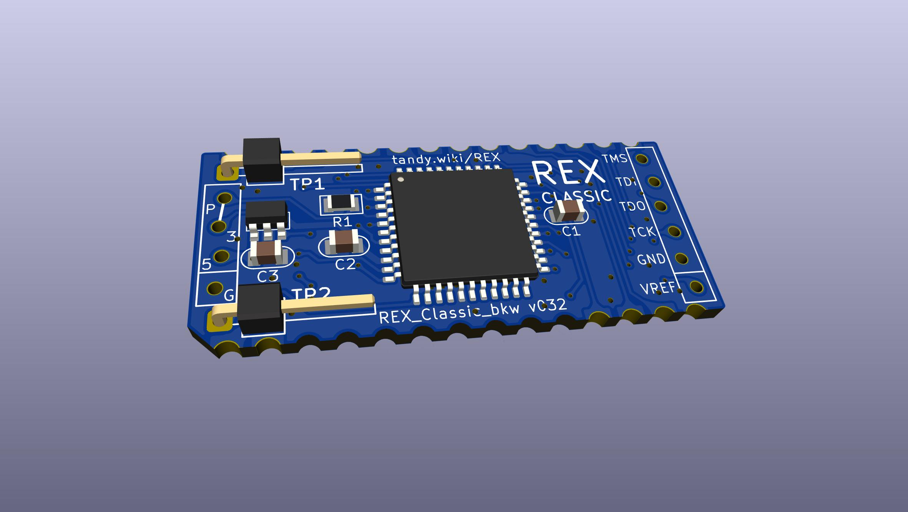
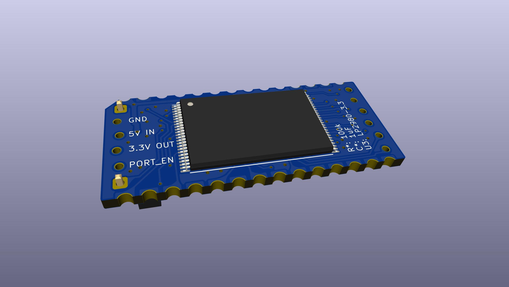
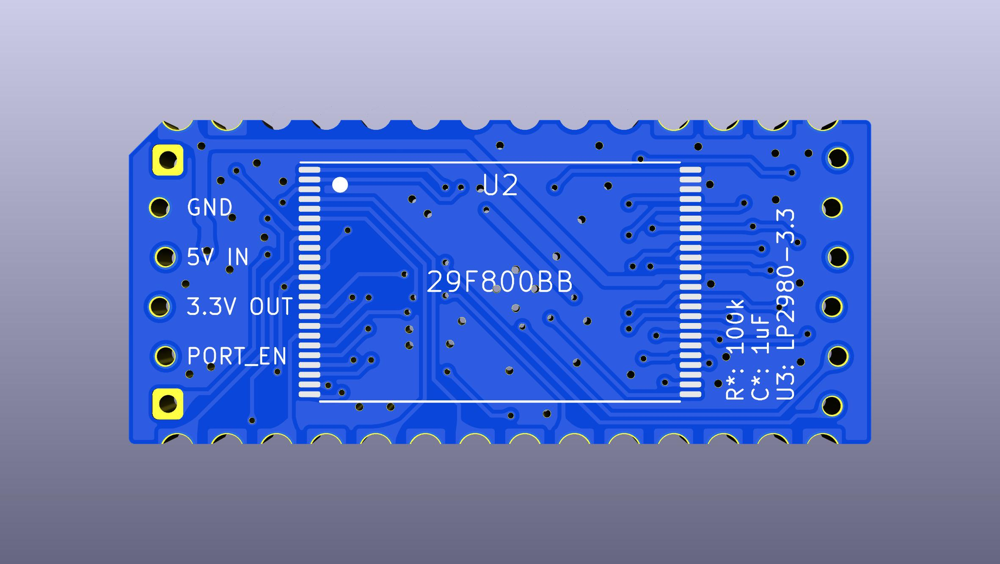

# REX Classic, BKW re-spin
  
  
  
  
  
  

### Directions
http://tandy.wiki/REX

Gerbers & cpld bitstream in [releases](../../releases/latest).

BOM: [DigiKey](https://www.digikey.com/short/zwwvvr2j)  
PCB & Carrier: [PCBWAY](https://www.pcbway.com/project/shareproject/REX_Classic__BKW_re_spin.html)

Ordering tips for the pcb & carrier:  
* on PCBWAY manually change the min tracks/spaces to 6mil/6mil
* For gold contacts, select ENIG copper finish
* For the carrier select material Nylon, process SLS
* PCBWAY is more expensive, especially for ENIG, and they don't have the best print option for the carrier.
  Elecrow is cheaper for ENIG, and their "High Strength Nylon" option for 3d printing is actually black nylon printed by MJF, which is the nicest for this.
  It's just that on Elecrow you have to upload the gerber zip and carrier stl from [releases](../../releases/latest), there is no pre-configured buy page.

Carrier cad source: https://github.com/bkw777/Molex78802_Module (PCB_28 variant)

### Original REX design is by Steven Adolph
http://bitchin100.com/wiki/index.php?title=REX  
http://www.club100.org/memfiles/index.php?direction=0&order=&directory=Steve%20Adolph
