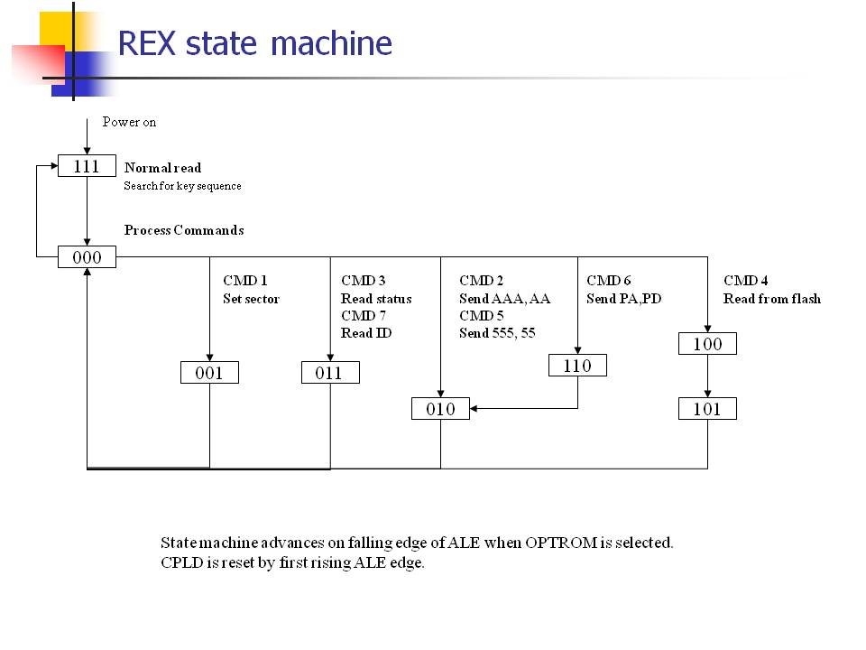

(ed: translated from https://bitchin100.com/wiki/index.php?title=REX_Overview)

## REX Overview

REX is a low power 1MB flash card custom designed to work with the Model T.  The challenge for REX is to be able to accomplish a "write" in a socket designed only for "reads".  An additional challenge, is to be able to control 19 address lines and 8 data lines to the flash, with a minimum amount of resources.  

A major challenge with REX, was finding a CPLD with enough I/O to manage the flash, while being small enough to fit in the socket.

## REX Architecture

The architecture of REX is shown in the illustration below.  Here we see that the CPLD (a programmable logic device, the "brains" of REX) sits between the flash chip and the option rom socket connector.  

REX manages only some of the address lines going to the flash - A15-A19, and A0-A7.  A8-A14 are provided as direct connections from the optrom socket, as are AD0-AD7.  REX intercepts the address/data bus AD0-AD7, and the system communicates with the CPLD using data sent on these lines.

Data is sent to REX on the falling edge of the ALE signal.  During this time, the address/data bus AD0-AD7 contains the lower address information for that CPU cycle.

So, in order to send data to REX, the data is sent as the bottom 8 bits of the ADDRESS, not the DATA, during a read cycle from the option rom.


![]Rex_architecture.jpg)


REX needs to distinguish between "normal reads" to the option rom, and "control reads" to REX.  In order to tell them apart, REX listens for a sequence of 6 reads from specific memory locations.  When this key sequence is observed, REX jumps into a command mode, to allow control of REX and manipulation of the flash.

## REX State Machine

The following illustration is the REX state machine.  This heavily optimised state machine has commands to set and read the registers of REX, and to send specific sequences to the flash to allow programming and erasing of the different blocks in the flash.

The state machine has been optimised for high speed operation as well as maximum flexibility.  REX is able to program a 32k binary image in under 4 seconds.




## REX Flash Organization

REX makes 32k blocks of flash memory visible to the Model T, and the currently visible block is selected by programming the sector register.  The flash is organised according to the following diagram.


Here we see 6 blocks of flash, including block 0, reserved for system use, and 26 blocks are free for use to store images.

Block 0 is a special block, in that it may be erased independantly of any other block, and in 3 sections, a 16k section and 2 8k sections.  Block 1 may be erased independantly of any other block, and is a stand alone 32k block.  The remaining blocks are actually associated with a 64k sector - 2 adjacent blocks form a sector, and the entire sector must be erased at the same time.  

This poses a challenge for REX, since REX images are all 32k in size.   In general, in order to erase a block, the adjacent block must be copied to a free block first, to allow a complete erasure of the 64k sector.

128k is reserved for main rom replacement.  64k is reserved for primary main rom, and 64k is reserved for a secondary main rom.   In practice it is expected that the primary main rom gets programmed once, and left alone, since it is critical to allow reliable booting once the user unplugs the original equipment ROM.  That leaves the secondary rom for custom loads.

M100/T102 needs only 32k for each main rom, but T200 needs 40k (IE 64k).


## REX Registers

REX has 2 internal registers - the version register (read only) and the status register (read/write).  The definitions of these registers is illustrated below.


## REX Mananger Flow Chart


## Low Level REX Support Subroutines


[REX support routines ASM](rex_routines.zip)

The above file (as at release 4.6) includes all the low level REX specific subroutines for manipulating REX and the onboard FLASH. 

These routines must run in upper RAM, typically ALTLCD, because, well, REX is bank switching in the lower RAM.  Also, interrupts must always be disabled when accessing REX.  Be careful, some main ROM routines enable interrupts.

In general it is very important to understand what state REX is in.  Often I am referring to "state 111" or "state 000".  State 111 is the "normal operation" state where REX is acting like an option ROM.  Entry into state 000 occurs after the unlock key sequence is sent.   State 000 is the control state where REX can be instructed to do various things.

I would recommend that any one reading this might want to download the data sheet for the AM29F800BB flash part, and learn about how to manipulate it.

(ed: there is a copy in PCB/datasheets)

There are 4 "very low level" subroutines that are the basis for all REX operations.  These routines are called by "higher level low level subroutines".  They are

```
SNDKEY
	sends the key sequence to REX 
	entry:  none, in any state
	exit:	in state 00
	registers changed: none
SETBLOCK
	sends command 2 to REX
	entry:  a = target block
	exit:	none
	registers changed: a
WAITREADY
	sends command 3 to REX, reads status and version bytes, and returns only when flash status is ready
	entry: 	none
	exit:	b = status byte, c = version byte
	registers changed: a, hl, bc
PROGBYTE
	program a byte into the flash -  program data from b to (de)
	entry: 	de = PA, data in b
	exit:	none
	registers changed: a, hl - preseves bc and de
```

Please see the above file for examples of code that programs a block of data into REX, reading the REX status register, etc.


## The REX Communication Method

REX uses a unique approach to bi-directional communication in a read-only socket, which is 100% reliant on the architecture of the 8085.

Reads are simple - the socket is designed for Read Only.

Writes are the challenge, with the signals available.

The 8085 uses a multiplexed address and data bus, and the ALE signal is used to discriminate address from data early in the CPU cycle.  Normally address data is captured on the falling edge of ALE.  We use this fact to send data to REX embedded in the lower address byte.

REX watches the address bus for READ operations (signaled by /CS to the option rom socket), and listens to the lower byte.

To send data to REX then, one must perform a READ to the optrom socket, where the desired data is actually the lower address field.  REX is clocked from ALE, so it will respond to stimulus from the bus on the falling edge of ALE.

REX mostly ignores this data, and acts like a normal option rom, until it senses the key sequence has been sent.  When a sequence of 6 reads from addresses with specific bytes in the lower address field are seen, REX transitions from the default power up state into the command state.

The key sequence happens to be: B6 F2 34 B0 31 BF (hex).


## Power Up and RESET of REX

REX does not see the reset signal in the PC.  So, reset does not affect REX. REX is reset by power down/up.

When REX is reset, it reverts to it's power up default - state 111 and block 0 present.

If by chance the flash chip hangs with status bit 0, then power cycling the machine will also reset the FLASH to normal operation.